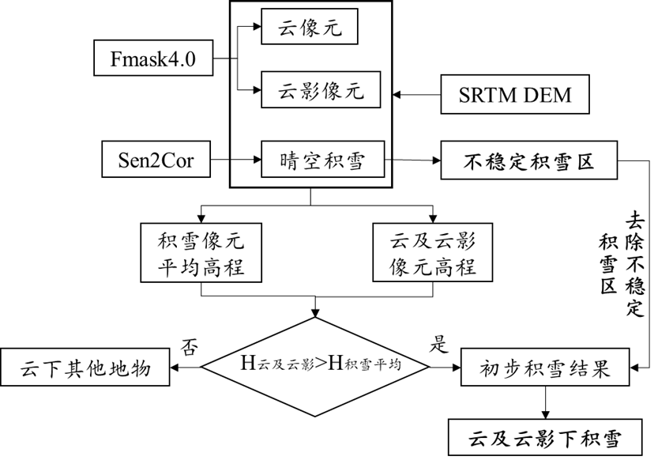
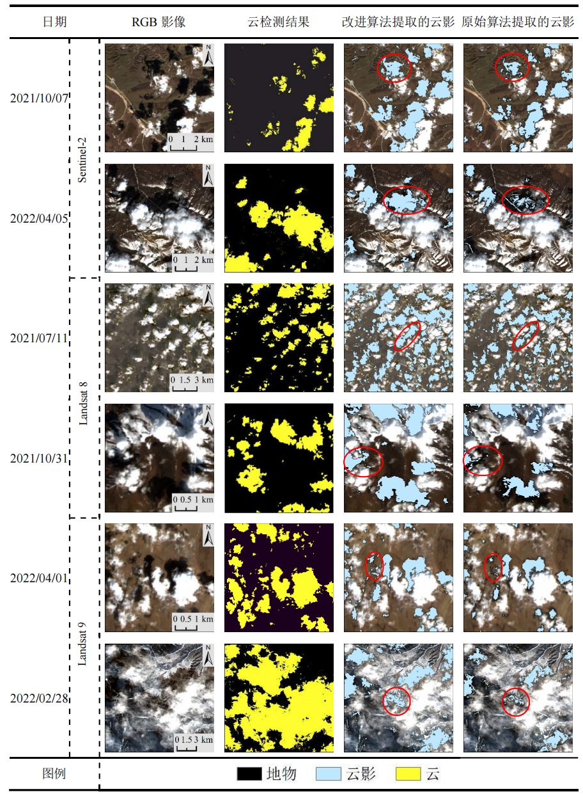
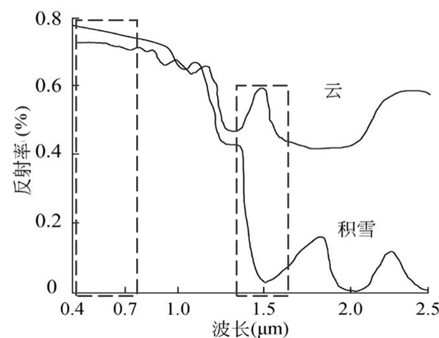
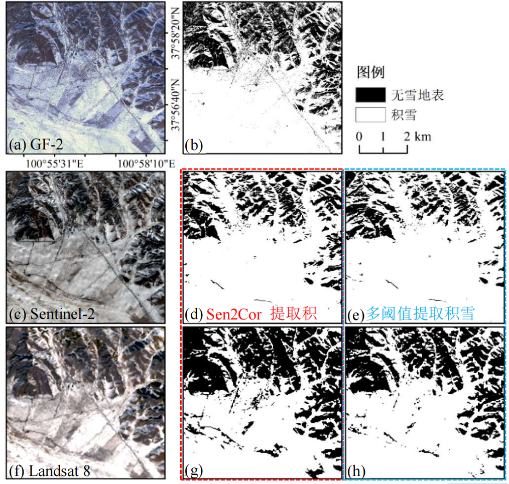
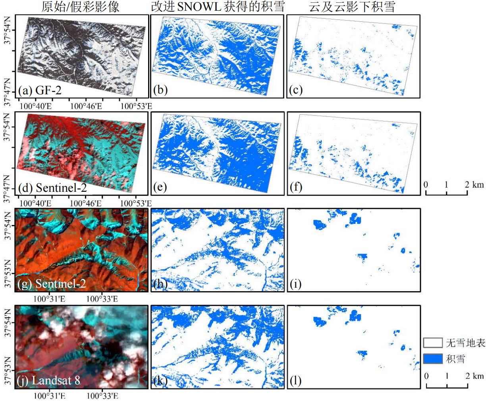

# SnowRUCCS

**Snow Recognition Under Cloud Cover System**

An algorithm for reconstructing snow cover information under clouds and cloud shadows using Sentinel-2 and Landsat 8/9 imagery.

## Overview

Cloud contamination is a major challenge for optical remote sensing of snow cover. This repository provides Google Earth Engine (GEE) scripts implementing an elevation-stratified approach to reconstruct snow information in cloud-covered and cloud-shadowed areas.

The algorithm combines:
- **FMask 4.0-based cloud detection** with two-pass refinement
- **Improved cloud shadow detection** using terrain shadow masking
- **Elevation-stratified snow reconstruction** based on clear-sky snow statistics

## Algorithm Workflow



*Figure 1: Snow reconstruction algorithm flowchart for Sentinel-2 and Landsat 8/9 imagery*

The workflow consists of the following main steps:
1. Cloud pixel detection using FMask 4.0 algorithm
2. Cloud shadow detection with terrain shadow exclusion
3. Clear-sky snow extraction using Sen2Cor/multi-threshold methods
4. Identification of unstable snow zones using SRTM DEM
5. Elevation-stratified snow reconstruction under clouds

## Features

### Two-Pass Cloud Detection
- **Pass One (PCP)**: Basic test, whiteness test, HOT test, NIR/SWIR ratio test, Cirrus test
- **Pass Two**: Probability-based refinement using temperature and spectral variability

### Improved Cloud Shadow Detection



*Figure 2: Comparison between improved and original cloud shadow detection algorithms for Sentinel-2 and Landsat 8/9 imagery*

Key improvements:
- FMask fillMinima algorithm for shadow candidate identification
- Terrain shadow masking using solar geometry and DEM
- Land cover-specific thresholds for different surface types

### Snow Detection Based on Spectral Characteristics



*Figure 3: Spectral reflectance curves of clouds and snow*

The algorithm exploits the distinct spectral signatures of snow and clouds:
- **Visible bands (0.4-0.7 μm)**: Both snow and clouds have high reflectance
- **SWIR bands (1.4-1.7 μm)**: Snow has much lower reflectance than clouds
- **NDSI threshold**: Effectively separates snow from clouds

### Multi-Sensor Snow Extraction



*Figure 4: Comparison of clear-sky snow extraction results from Sentinel-2, Landsat 8, and GF-2*

### Snow Reconstruction Results



*Figure 5: Snow reconstruction results under clouds and cloud shadows for Sentinel-2 and Landsat 8*

## Data Sources

| Dataset | Description | Resolution |
|---------|-------------|------------|
| Sentinel-2 L1C | Cirrus band (B10) | 60m |
| Sentinel-2 L2A | Surface reflectance bands | 10-60m |
| Landsat 8/9 TOA | Top-of-atmosphere reflectance | 30m |
| JRC Global Surface Water | Water occurrence data | 30m |
| SRTM DEM | Elevation, slope, aspect | 30m |
| ESA WorldCover | Land cover classification | 10m |

## Usage

### Prerequisites
- Google Earth Engine account ([Sign up here](https://earthengine.google.com/))
- Basic knowledge of JavaScript and GEE API

### Quick Start

1. Open [Google Earth Engine Code Editor](https://code.earthengine.google.com/)

2. Create a new script and copy the contents of `SnowRUCCS.js`

3. Define your study area:
```javascript
// Option 1: Use a FeatureCollection asset
var roi = ee.FeatureCollection("users/your_username/your_study_area").geometry();

// Option 2: Define a polygon manually
var roi = ee.Geometry.Polygon([
  [[lon1, lat1], [lon2, lat2], [lon3, lat3], [lon4, lat4], [lon1, lat1]]
]);
```

4. Set the date range:
```javascript
var s_date = ee.Date('2020-03-21');
var e_date = ee.Date('2020-03-22');
```

5. Run the script to generate:
   - Cloud mask
   - Cloud shadow mask
   - Clear-sky snow map
   - Reconstructed snow map (including snow under clouds)

### Output Layers

| Layer Name | Description |
|------------|-------------|
| `Study Area` | Input study region boundary |
| `Sentinel-2 RGB` | False color composite (NIR-Red-Green) |
| `PCP Mask` | Potential cloud pixels |
| `Cloud Probability` | Cloud probability (0-1) |
| `Cloud Mask` | Final cloud mask |
| `Cloud Shadow` | Cloud shadow mask |
| `Clear-sky Snow` | Snow detected in clear areas |
| `Reconstructed Snow (All)` | Complete snow map including cloud-covered areas |

### Export Results

Uncomment the export section in the script to save results to Google Drive:

```javascript
Export.image.toDrive({
  image: allsnowall.first(),
  description: 'Snow_Reconstructed',
  folder: 'SnowRUCCS_Results',
  region: roi,
  scale: 10,
  maxPixels: 1e13
});
```

## File Structure

```
SnowRUCCS/
├── SnowRUCCS.js          # Main GEE script for Sentinel-2
├── images/               # Documentation figures
│   ├── fig1_algorithm_flowchart.png
│   ├── fig2_cloud_shadow_comparison.png
│   ├── fig3_spectral_curves.png
│   ├── fig4_snow_extraction_comparison.png
│   └── fig5_snow_reconstruction_results.png
├── LICENSE
└── README.md
```

## Algorithm Parameters

Key parameters that can be adjusted:

| Parameter | Default | Description |
|-----------|---------|-------------|
| NDSI threshold | 0.15 | Minimum NDSI for snow detection |
| NIR threshold | 0.15 | Minimum NIR reflectance for snow |
| Blue threshold | 0.28 | Minimum Blue reflectance for snow |
| Blue/Red ratio | 0.80 | Minimum Blue/Red ratio for snow |
| Elevation step | 300m | Interval for elevation stratification |
| Cloud probability | 0.9 | Threshold for final cloud classification |

## Citation

If you use this algorithm in your research, please cite:

```
@misc{snowruccs2024,
  author = {SnowRUCCS Contributors},
  title = {SnowRUCCS: Snow Recognition Under Cloud Cover System},
  year = {2024},
  publisher = {GitHub},
  url = {https://github.com/bugu1234/SnowRUCCS}
}
```

## License

This project is licensed under the MIT License - see the [LICENSE](LICENSE) file for details.

## Acknowledgments

- Google Earth Engine team for the cloud computing platform
- FMask algorithm developers for cloud detection methodology
- ESA and USGS for providing satellite imagery

## Contact

For questions or suggestions, please open an issue on GitHub.
